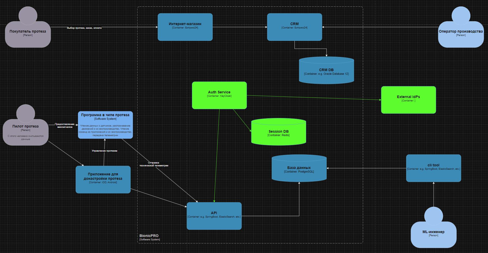
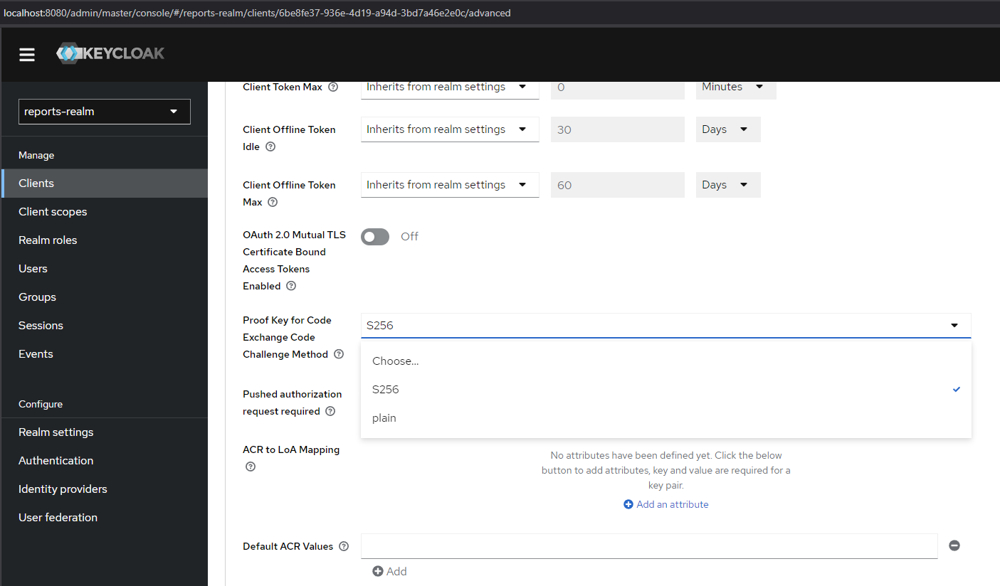
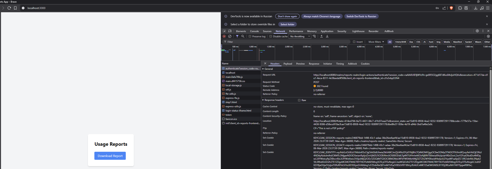
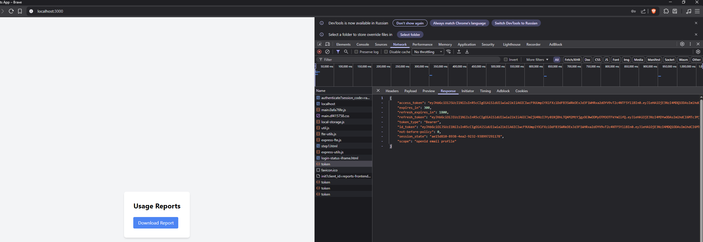
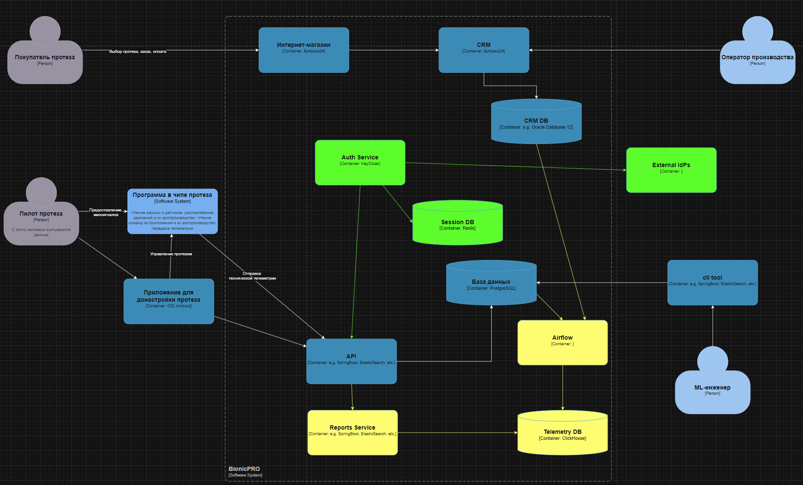
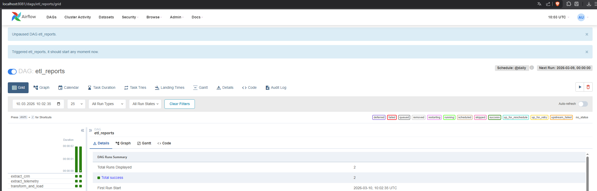
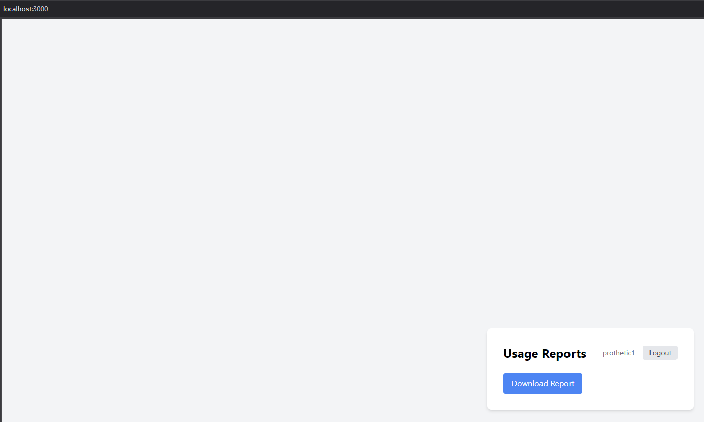
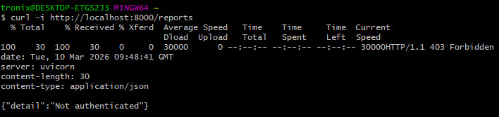

## Task 1

Обновленная диаграмма:



По адресу http://localhost:8080/ по пути reports-realm/clients/reports-frontend/advanced проверяем, что Keycloak подцепился:


При переходе с 3000 для login.css генерируется следующий адрес с параметрами, где есть параметр code_challenge от Keycloak:

http://localhost:8080/realms/reports-realm/protocol/openid-connect/auth?client_id=reports-frontend&redirect_uri=http%3A%2F%2Flocalhost%3A3000%2F&state=614ed766-8a73-4431-84c7-d1fc07eaa27e&response_mode=fragment&response_type=code&scope=openid&nonce=7c729868-ad08-4ea9-8ea2-795411de0e66&code_challenge=_NYG9VpiqPkAJmgrPYzLk8IgXP3nSrZ-vLV0iF0fQX0&code_challenge_method=S256

После авторизации (например, под admin1) видим использование Keycloak при редиректе и токены access и refresh:



## Task 2

Диаграмма:


Для запуска сервиса (или перезапуска) используем команду:

```
docker-compose down -v && docker-compose up --build
```

Запускаем задания в airflow:


Проверяем выгрузку отчётов, для каждого пользователя должен сформироваться свой.


Выгрузится следующее:

Для пользователя prothetic1 (SN-001):

```
{
  "username": "prothetic1",
  "report": [
    {
      "prosthesis_serial": "SN-001",
      "report_date": "2026-03-09",
      "avg_response_ms": 82.5,
      "movement_count": 120,
      "processed_at": "2026-03-10 09:39:54"
    },
    {
      "prosthesis_serial": "SN-001",
      "report_date": "2026-03-10",
      "avg_response_ms": 79.3,
      "movement_count": 135,
      "processed_at": "2026-03-10 09:40:03"
    }
  ]
}
```

Для пользователя prothetic2 (SN-002):

```
{
  "username": "prothetic2",
  "report": [
    {
      "prosthesis_serial": "SN-002",
      "report_date": "2026-03-09",
      "avg_response_ms": 91,
      "movement_count": 98,
      "processed_at": "2026-03-10 09:39:54"
    },
    {
      "prosthesis_serial": "SN-002",
      "report_date": "2026-03-10",
      "avg_response_ms": 88.7,
      "movement_count": 110,
      "processed_at": "2026-03-10 09:40:03"
    }
  ]
}
```

Проверка, что пользователь без авторизации не получит доступа:

